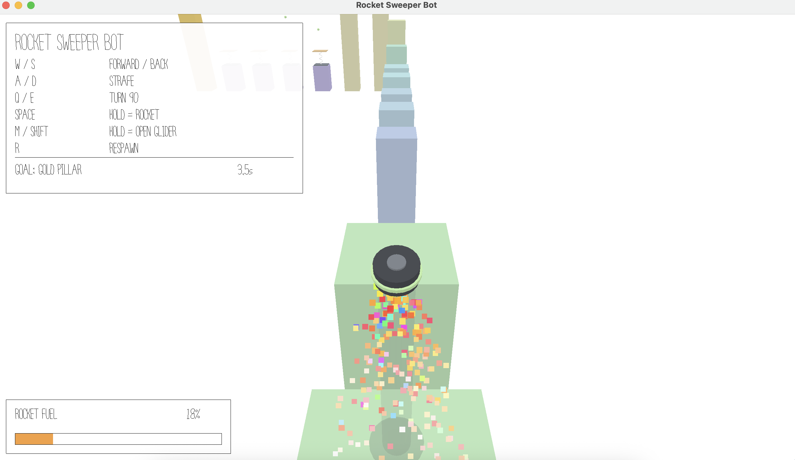

# Rocket Sweeper Bot

Author: Deming Xu

Design: A sweeper robot with a rocket backpack hops across 1x1 pillars. Kinetic energy is the core currency: fold the glider to dive, slam a spring pad, and it hands every bit of that energy back as launch speed.

Screen Shot:



How To Play:

- W / S / A / D: move relative to the robot's facing
- Q / E: turn 90 degrees (camera follows)
- SPACE (hold): rocket. Fuel refills instantly on landing
- M or SHIFT (hold): open the glider (slow fall). Otherwise you drop fast
- R: respawn at the last pillar you stood on
- Reach the gold pillar. Green orbs refill fuel; spring pads bounce you back up with the speed you hit them at and add 10% fuel

Build and Run (needs `nest-libs` as a sibling folder, see NEST.md):

```bash
node Maekfile.js
cd dist && ./game
```

Re-export assets after editing the `.blend` files (needs Blender; path is set in `scenes/Makefile`):

```bash
cd scenes && make
```

This game was built with [NEST](NEST.md).
